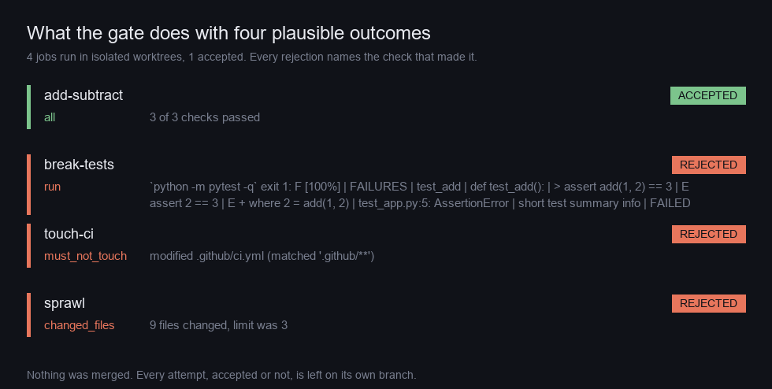
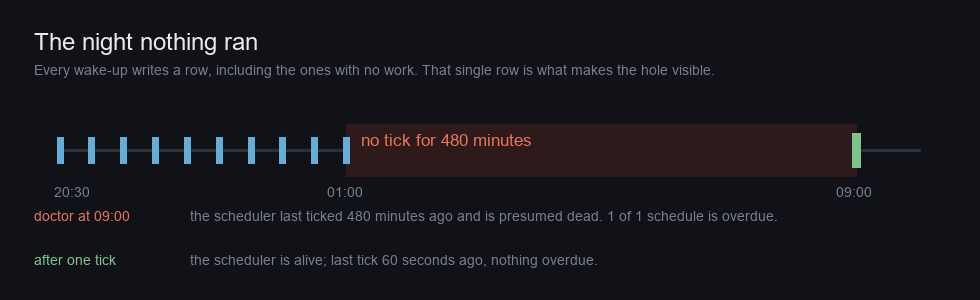

# runproof

[](https://github.com/CAOShurong/runproof/actions/workflows/ci.yml)
[](https://pypi.org/project/runproof/)
[](https://pypi.org/project/runproof/)
[](LICENSE)
[](pyproject.toml)

**Run coding-agent work unattended, and prove it actually worked.**

You describe a job — *upgrade this dependency and keep the tests green*, *add
type hints to this module*, *fix the flaky test* — and runproof runs it in an
isolated `git worktree` with a real agent, then **refuses to accept the result
unless it passes the checks you declared**. What survives is a branch you can
merge. What doesn't is a report saying exactly where it failed.

The agent's own summary of its work is never consulted. Only the diff is.

```console
$ runproof run jobs/upgrade-requests.yaml

runproof upgrade-requests  run 7
  FAILED  1/3 attempts passed -- the job succeeds sometimes, which is not the same as working
  ✗ attempt 1  184.2s  runproof/upgrade-requests-1-4bf48e
      ✗ run
         `python -m pytest -q` exit 1: FAILED tests/test_client.py::test_retry - TypeError: unexpected keyword 'allowed_methods'
      ✓ changed_files
         3 files changed, within max 12
  ✓ attempt 2  201.7s  runproof/upgrade-requests-2-9c1a03
  ✗ attempt 3  177.9s  runproof/upgrade-requests-3-e07b21
      ✗ must_not_touch
         modified requirements.lock (matched '*.lock')

  Nothing was merged. Each attempt is on its own branch above,
  still checked out-able, so you can see what it did.

$ echo $?
1
```

Three runs of the same prompt, three different outcomes. That is what agents
are actually like, and reporting the last one as *the* result turns a coin flip
into a fact.

## Install

```bash
pip install runproof
```

No dependencies. Python 3.9+. `git` must be on PATH — isolation is the feature,
not a nicety, so runproof refuses to start without it.

## The 60-second version

```yaml
# jobs/upgrade-requests.yaml
name: upgrade-requests
prompt: |
  Upgrade the `requests` dependency to the latest 2.x and fix any breakage.
  Do not touch the lockfile; it is generated.
adapter: claude
attempts: 3            # agents are stochastic; one run proves nothing
checks:
  - run: python -m pytest -q
  - run: python -m ruff check src
  - changed_files: {max: 12}
  - diff_lines: {max: 400}
  - must_not_touch: ["*.lock", ".github/**"]
limits:
  wall_seconds: 1800
```

```bash
runproof run jobs/upgrade-requests.yaml
```

`checks` is the whole product. Everything else is plumbing. A job with **no**
checks is a validation error, not a job that always passes — see
[Why an empty `checks` is an error](#why-an-empty-checks-is-an-error).

<!-- BEGIN GENERATED -->

### Four plausible outcomes, one of them acceptable

Built by `docs/build_docs.py`, which creates a git repository with a passing
test suite, dispatches the four jobs below at it, and renders whatever comes
back. Nothing in this section is typed by hand; `--check` fails the build if
any of it drifts from what the code produces.



| job | what the agent did | verdict | the check that decided it |
| --- | --- | --- | --- |
| `add-subtract` | Add a `sub` function next to `add`, and keep the suite green. | accepted | 3 of 3 checks passed |
| `break-tests` | The agent 'simplified' `add` and did not run the suite. | **rejected** by `run` | `python -m pytest -q` exit 1: F [100%] \| FAILURES \| test_add \| def test_add(): \| > assert add(1, … |
| `touch-ci` | The agent decided the build configuration was the problem. | **rejected** by `must_not_touch` | modified .github/ci.yml (matched '.github/**') |
| `sprawl` | The agent refactored the whole package while it was in there. | **rejected** by `changed_files` | 9 files changed, limit was 3 |

**1 of 4 accepted.** Every one of the
3 rejections leaves a green-looking agent transcript
behind it — the command exited zero, the files were written, the summary would
have read well. The diff is the only thing that was consulted.

### The failure this was written after



A scheduler that dispatches nothing looks exactly like a scheduler with
nothing to dispatch. So every wake-up writes a row whether or not there was
work, and `runproof doctor` reads it back:

```console
$ runproof doctor
  ✗ the scheduler last ticked 480 minutes ago and is presumed dead. 1 of 1 schedule is overdue.
```

One tick later, the same command, and the missed windows accounted for rather
than fired:

```console
$ runproof tick && runproof doctor
  ✓ the scheduler is alive; last tick 60 seconds ago, nothing overdue.
```

```text
nightly: skipped 15 missed window(s), catching up once
```

15 missed windows, **one** catch-up run. A scheduler that fired the whole
backlog on waking would put 15 agents on one repository at once, which is
a worse morning than the one it was recovering from.

<!-- END GENERATED -->

## Why this exists

On 2026-08-04 a chain of thirteen scheduled agent runs was set up to build a
project overnight. **Not one of them fired.** The scheduler stopped dispatching
at 00:39 and never recovered. Every task sat with its next-run time in the past
and no last-run time at all — which is exactly what a task that had *never been
scheduled* looks like. The failure was silent in both directions: nothing ran,
and nothing said that nothing had run. Establishing that took an afternoon of
hand-parsing log files, and the first two diagnoses were wrong.

Three requirements fall straight out of that, and they are the spine of this
project.

**A scheduler that cannot fail silently.** Every wake-up writes a row, and
every run writes a heartbeat before it does anything else. A missing row is a
loud, queryable fact. *The sidebar showed the task* is not evidence.

**Results land in the repository, not in a session.** A run that leaves nothing
on disk is indistinguishable from a run that never started. Every attempt
leaves a branch, and a rejected one is kept precisely because it is the
interesting one.

**Unverified work is not work.** An agent that edits ten files and breaks the
suite has produced negative value. The tool must say so before a human spends
attention on it.

## What it will not do

Stated up front, because a tool that gates other software is only useful if you
know where its judgement stops.

**It does not merge anything, ever.** Not with a flag, not with `--yes`. Every
accepted attempt is left on its own branch and taking it is one `git merge`
that you type. A tool that proves work is acceptable and a tool that lands work
in your default branch are different products, and only one of them can be left
running overnight without a conversation about blast radius.

**It does not judge quality, only the checks you wrote.** If your only check is
`run: python -m pytest -q`, then runproof will accept a diff that deletes the
feature and the test together. The gate is exactly as good as the spec, and no
amount of tooling fixes a spec that asks for nothing. `must_touch`,
`changed_files: {min: N}` and `file_contains` exist because "the suite is
green" is the weakest interesting claim.

**It does not parse real YAML.** It parses a deliberately small subset —
nested mappings, sequences, scalars, `|` blocks — and raises on everything
else, including anchors, aliases, tags, folded scalars and tabs. A hand-rolled
YAML parser is a well-earned smell, and what makes one dangerous is *silent*
misinterpretation. This one has no silent path: every construct is either
supported and tested, or a `SpecError` naming the line. That buys zero runtime
dependencies for a file format that is, in practice, a dozen lines of mapping.
For anything larger it would be the wrong trade.

**It does not sandbox the agent.** A worktree is isolation from *your working
tree*, not from your machine. The agent runs with your permissions and can
reach the network. If that matters, run runproof inside the container you were
going to use anyway.

**It has no daemon.** `runproof tick` is the entire scheduler, and something
else must call it — cron, a systemd timer, Task Scheduler, a loop in a
terminal. That is deliberate: a background process that owns its own wake-up is
a background process that can die quietly, which is the failure this package
was written after. Borrowing cron's reliability also borrows its visibility.

## How it works

Eight subsystems. Dependencies point downward only: `runner` uses everything
below it, and `spec` and `store` know about nothing.

| module | what it owns |
| --- | --- |
| [`spec.py`](src/runproof/spec.py) | job definition, validation, and the restricted YAML parser |
| [`worktree.py`](src/runproof/worktree.py) | `git worktree` lifecycle, and the diff measured against the base commit |
| [`adapters.py`](src/runproof/adapters.py) | driving `claude`, `codex`, or a plain shell command |
| [`verify.py`](src/runproof/verify.py) | **the gate** — checks, and the verdict |
| [`store.py`](src/runproof/store.py) | SQLite history in `.runproof/runs.db`, append-only |
| [`runner.py`](src/runproof/runner.py) | orchestration, and the pass rate |
| [`schedule.py`](src/runproof/schedule.py) | dispatch, heartbeats, liveness, catch-up |
| [`report.py`](src/runproof/report.py) + [`cli.py`](src/runproof/cli.py) | what happened, and what it cost |

Every module's docstring states the problem and the decision before any code.
If you read one, read [`verify.py`](src/runproof/verify.py) — everything else
is plumbing for it.

### The lifecycle of one attempt

1. **Isolate.** `git worktree add -b runproof/<job>-<n>-<rand>` off `HEAD`, in a
   temporary directory. If isolation cannot be obtained, the run refuses to
   start rather than degrading to "just run it in place" — which is the single
   most destructive thing this tool could do, and exactly what a helpful
   fallback would look like.
2. **Heartbeat.** A row is written *before* the agent starts. A process that
   dies leaves that row saying `running` with a stale timestamp, and
   `runproof doctor` finds it.
3. **Drive.** The adapter runs the agent inside the worktree. It gets a wall
   clock ceiling whether the job asked for one or not.
4. **Measure.** `git diff --numstat` against the base commit — not "files
   written". An agent that creates a file and deletes it again has changed
   nothing.
5. **Verify.** Structural checks first (diff size, forbidden paths), then
   commands. An attempt that touched `.github/` is rejected before a test suite
   spends four minutes agreeing.
6. **Record.** Every check, with its detail, into SQLite. The worktree is
   removed; **the branch is kept**. A rejected attempt you can check out is
   evidence; one that was deleted is a rumour.

### Checks

| check | means |
| --- | --- |
| `run: <command>` | the command must exit zero, inside the worktree |
| `changed_files: {min, max}` | bounds on how many files the attempt touched |
| `diff_lines: {min, max}` | bounds on insertions + deletions |
| `must_not_touch: [patterns]` | paths the attempt is forbidden to modify |
| `must_touch: [patterns]` | paths the attempt is required to modify |
| `file_contains: {path, text}` | a file that must contain a string at the end |

Two rules that matter more than the list.

**Detail is quoted, never summarised.** A report saying "tests failed" sends
you back to the logs, which is where you were before you installed anything. A
failing command reports its exit code and the lines that mattered; a size limit
reports the actual number against the limit; a forbidden path reports *which*
path and which pattern caught it. The rule of thumb: a check's detail should
let you decide what to do next without opening anything else.

**A check that cannot run is a failure, not a skip.** Missing test command,
absent file, timeout — all rejections. Treating "could not verify" as "fine"
would reintroduce, in one line, the exact hole this project exists to close.

### Why an empty `checks` is an error

```console
$ runproof run no-checks.yaml
runproof: no-checks.yaml: `checks` must be a non-empty list. A job with nothing
to verify cannot be accepted or rejected, and accepting unverifiable work is
the failure this tool exists to prevent.
```

The accommodating alternative — treat "no checks" as "nothing to fail" — turns
every typo into a rubber stamp. `checks` is also validated at *parse* time, so
a job with an unknown check name fails before an agent has been paid to do the
work, not after.

## Scheduling

There is no daemon. `runproof tick` dispatches whatever is due and records
having looked either way.

```bash
runproof schedule add jobs/nightly.yaml --every 3600
```

```cron
# Every ten minutes. `tick` is cheap when nothing is due -- it writes one row.
*/10 * * * * cd /path/to/repo && runproof tick >> /var/log/runproof.log 2>&1
```

```powershell
# Windows Task Scheduler, every 10 minutes
schtasks /create /tn runproof /sc minute /mo 10 /tr "cmd /c cd /d C:\repo && runproof tick"
```

Then, in the morning, one command answers the question that cost an afternoon:

```bash
runproof doctor
```

It exits non-zero when the dispatcher is dead or a run has gone quiet, so it is
a one-line monitoring check.

**A missed window is caught up once, not N times.** A scheduler that was down
for six hours must not fire six backlogged runs the moment it returns — that is
a thundering herd of agents against one repository. Each schedule catches up a
single run and the skipped windows are recorded with a reason attached.

## Adapters

| `adapter:` | what it drives |
| --- | --- |
| `claude` | the `claude` CLI in headless print mode (`-p`, `--output-format json`) |
| `codex` | the `codex` CLI (`codex exec`) |
| `shell` | the prompt, as a shell command |

The core treats all three as "something that edits a worktree", so **comparing
two agents on the same job is a configuration change, not a fork**. The gate
never learns which one produced the diff, which is what stops a well-behaved
agent from being graded more kindly than a shell script.

`shell` is not a toy. Codemods, formatters and migration scripts all want the
same *change the tree, then prove nothing broke* treatment, and it makes the
whole pipeline testable with no agent, no API key and no cost. Every test in
this package uses it.

The `claude` adapter defaults to `--permission-mode bypassPermissions`, which
is a real decision: an unattended run cannot answer a prompt, so anything less
means the agent stalls forever on the first edit. It is safe *because* of the
worktree — the agent has write access to a throwaway checkout, not to your
tree.

## Exit codes

| code | meaning |
| --- | --- |
| `0` | accepted — every attempt that was required passed its checks |
| `1` | ran fine, the work was not acceptable |
| `2` | could not run at all — bad spec, no repository, no git |

The middle one is the interesting case. A job whose agent produced work that
failed the checks is *not* an error; the tool did exactly what it was asked.
Folding it into `2` would make every rejected agent run look like a crashed
tool. Folding it into `0` would make a CI check useless.

## Commands

```console
runproof run <spec>            run a job now and verify the result
runproof status                recent runs, newest first
runproof doctor                is the scheduler alive, and what is late
runproof tick                  dispatch anything due (point cron at this)
runproof schedule add <spec> --every <seconds>
runproof schedule list | remove <job>
runproof show <run-id>         everything recorded about one run
runproof prune                 clear worktrees an interrupted run left behind
```

`--json` on any of them. `-C <dir>` to work on another repository.

## Prior art, and why this is not one of them

Checked on 2026-08-04 against the GitHub search API.

| space | state |
| --- | --- |
| Viewing and publishing transcripts | **Saturated.** The leaders have 1,648★ and 1,184★ |
| Usage and limit dashboards | Covered |
| Session analytics | Weak but present |
| "coding agent evaluation harness" | 5 repositories, **all 0★** |
| "autonomous background agent runner scheduler" | **0 results** |
| "agent task verification git worktree" | **0 results** |
| "compare claude code cursor codex same task" | **0 results** |

Everything that exists looks *backwards* at transcripts — it renders what an
agent already did, beautifully. Nothing runs work *forwards* and gates it. The
1,184★ leader in this space converts JSONL to HTML.

The nearest relatives are different products. **SWE-bench** and friends
benchmark models against a fixed dataset; runproof runs *your* job against
*your* repository. **CI** verifies a commit that already exists; runproof
decides whether the commit should exist. **`git worktree` wrappers** give
agents parallel checkouts; none of them has a verdict.

## Development

```bash
git clone https://github.com/CAOShurong/runproof
cd runproof
python -m pip install -e ".[dev]"
python -m pytest -q
```

80 tests. They are weighted at refusals — a spec that cannot be judged, a
worktree that cannot be obtained, a scheduler that is lying about being alive —
and at everything a real run has actually broken. Several are named after the
bug they exist to prevent, because the bug is more informative than the
behaviour:

- `test_a_single_attempt_is_not_dressed_up_as_more` — `all 1 attempts passed`
  both reads badly and overstates. One green attempt is the weakest evidence
  this tool produces.
- `test_a_dead_scheduler_cannot_look_healthy_because_the_clock_moved` — a tick
  stamped in the future made `now - last` negative, which passed the liveness
  threshold. A backwards clock resurrected a dead dispatcher.
- `test_indentation_inside_a_block_scalar_survives` — block scalars were
  left-aligned on parse, silently flattening any prompt containing code. For a
  tool whose entire input is prompts, that is not cosmetic.

Regenerate the figures and the generated part of the README:

```bash
python -m pip install pillow
python docs/build_docs.py
```

CI runs `python docs/build_docs.py --check` and fails if a number in the README
no longer matches what the code produces.

## License

MIT — see [LICENSE](LICENSE). Use it, fork it, ship it in something you sell.
Attribution is appreciated and not required.
